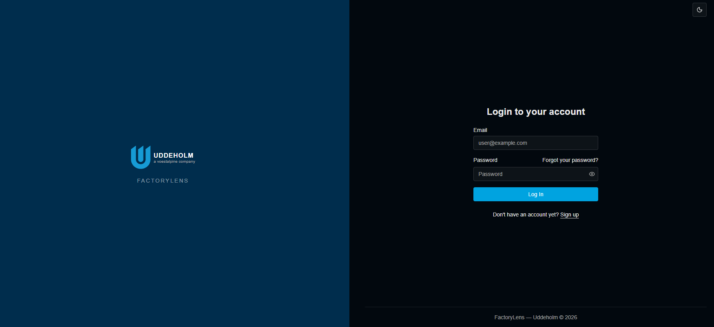
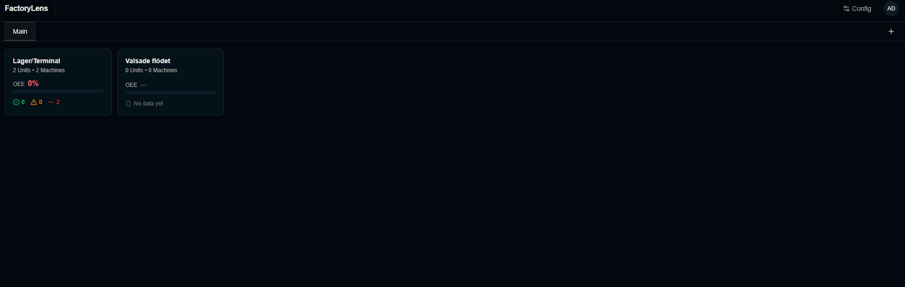

# FactoryLens

**FactoryLens** is a maintenance and production monitoring platform that provides real-time visibility into factory floor operations. It tracks Overall Equipment Effectiveness (OEE) metrics, production losses, and machine events across your manufacturing facility.

## What is FactoryLens?

FactoryLens enables manufacturers to monitor and improve their production efficiency through:

- **Real-time OEE Monitoring**: Track Availability, Performance, and Quality metrics for all your manufacturing equipment
- **Hierarchical Organization**: Organize your facility by Department → Unit → Machine for clear visibility at every level
- **Automated Data Collection**: Integrate with KepServer (industrial IoT gateway) via Apache Airflow for automated, minute-by-minute data ingestion
- **Production Loss Tracking**: Capture and categorize downtime reasons, slow production, and quality issues with timestamps and operator notes
- **Event Management**: Log and track machine events, alarms, maintenance activities, and production changes
- **Action Tracking**: Create and assign tasks to address equipment issues and improve operations

FactoryLens is designed for internal use by manufacturing teams, maintenance personnel, and operations managers who need data-driven insights to optimize production performance.

## Key Features

### 📊 Real-Time OEE Monitoring

Monitor your Overall Equipment Effectiveness metrics across all machines:

- **Availability**: Percentage of time equipment is running (vs. shut down)
- **Performance**: Production speed efficiency compared to ideal cycle time
- **Quality**: First-pass yield / defect rate

Each metric is color-coded for instant visibility:
- 🟢 **GREEN** (≥85%): Excellent performance
- 🟡 **YELLOW** (60-85%): Attention needed
- 🔴 **RED** (<60%): Critical issues requiring immediate action

### 🏭 Hierarchical Dashboard Views

Navigate your facility structure with customizable dashboard views:

- **Home View**: Overview of entire facility performance
- **Department View**: Aggregate OEE metrics and unit counts by department
- **Unit View**: Machine-level summaries within production units
- **Machine View**: Detailed machine status, alarms, events, and trends

Each view displays tile-based dashboards showing OEE summaries, status indicators, and equipment counts.

### ⏱️ Production Loss Tracking

Capture why and when production stops or slows down:

- **Loss Code Hierarchy**: Organize loss reasons by Type → Category → Code
- **Loss Code Entries**: Record start time, end time, loss code, and operator notes
- **Loss Types**: SHUT (complete stop), SLOW_PRODUCTION (reduced speed), NORMAL_PRODUCTION
- **Historical Analysis**: Review loss patterns to identify improvement opportunities

### 📝 Machine Event Logging

Comprehensive event tracking for every machine:

- **Event Types**: Operator notes, alarms, warnings, maintenance, quality issues, production changes, order changes
- **Severity Levels**: INFO, LOW, MEDIUM, HIGH, CRITICAL
- **Event Sources**: Operator-entered, system-generated, or integration-sourced
- **Event Status**: ACTIVE, ACKNOWLEDGED, CLEARED
- **Action Linking**: Connect events to follow-up actions for traceability

### ✅ Action & Issue Management

Track tasks and issues that need attention:

- **Action Status**: OPEN, IN_PROGRESS, CLOSED
- **Owner Assignment**: Assign responsibility for each action
- **Linked Events**: Associate actions with triggering events
- **Notes & Context**: Document details and resolution steps

### 🔄 Automated Data Collection

Apache Airflow DAG (`kepserver_poll`) automates OEE metric collection:

- Polls KepServer REST API every minute
- Reads configured tag values: `{prefix}.Availability`, `{prefix}.Performance`, `{prefix}.Quality`
- Calculates OEE status (GREEN/YELLOW/RED) automatically
- Writes timestamped `MachineStatus` records to PostgreSQL
- Handles failures gracefully with error logging

### 👥 User Management

- Multi-user system with role-based access control
- Superuser/admin capabilities for configuration
- JWT token-based authentication
- Email-based password recovery

## Screenshots

### Login



### Home Dashboard

View facility-wide performance at a glance with OEE summaries and status indicators.



### Unit Level View

Monitor production units with machine-level performance metrics and status tiles.


### Machine Level View

Detailed machine monitoring with real-time OEE metrics, active alarms, loss code entries, events, and action tracking.


## Technology Stack

- **Backend**: [FastAPI](https://fastapi.tiangolo.com) with [SQLModel](https://sqlmodel.tiangolo.com) ORM and [Pydantic](https://docs.pydantic.dev) validation
- **Database**: [PostgreSQL](https://www.postgresql.org)
- **Frontend**: [React](https://react.dev) with TypeScript, [Vite](https://vitejs.dev), [Tailwind CSS](https://tailwindcss.com), and [shadcn/ui](https://ui.shadcn.com)
- **Authentication**: JWT (JSON Web Token) with secure password hashing
- **Data Collection**: [Apache Airflow](https://airflow.apache.org) for automated KepServer polling
- **Containerization**: [Docker Compose](https://www.docker.com) for development and production
- **Reverse Proxy**: [Traefik](https://traefik.io) for routing and load balancing
- **Testing**: [Pytest](https://pytest.org) for backend, [Playwright](https://playwright.dev) for frontend E2E tests
- **Development Tools**: [Mailcatcher](https://mailcatcher.me) for local email testing

## Prerequisites

Before setting up FactoryLens, ensure you have:

- **Docker & Docker Compose**: Install [Docker Engine](https://docs.docker.com/engine/install/) (not Docker Desktop)
- **KepServer Access**: 
  - KepServer hostname/IP address
  - REST API port (default: 57412)
  - Authentication credentials
  - Configured OEE tags for your machines
- **SMTP Server** (optional): For email notifications and password recovery

## Setup Instructions

### 1. Clone the Repository

```bash
git clone <your-repository-url>
cd factorylens
```

### 2. Configure Environment Variables

Create a `.env` file in the project root with your configurations. At minimum, set these required variables:

```bash
# Security - MUST CHANGE THESE
SECRET_KEY=changethis
FIRST_SUPERUSER_PASSWORD=changethis
POSTGRES_PASSWORD=changethis

# Project Configuration
PROJECT_NAME="FactoryLens"
STACK_NAME="factorylens"
DOMAIN=localhost

# Database
POSTGRES_SERVER=db
POSTGRES_PORT=5432
POSTGRES_DB=app
POSTGRES_USER=postgres

# First Superuser
FIRST_SUPERUSER=admin@example.com

# Email Configuration (optional)
SMTP_HOST=
SMTP_USER=
SMTP_PASSWORD=
SMTP_PORT=587
EMAILS_FROM_EMAIL=info@example.com

# Sentry (optional)
SENTRY_DSN=
```

### 3. Generate Secret Keys

Replace `changethis` values with secure randomly-generated keys:

```bash
python -c "import secrets; print(secrets.token_urlsafe(32))"
```

Run this command three times to generate unique values for `SECRET_KEY`, `FIRST_SUPERUSER_PASSWORD`, and `POSTGRES_PASSWORD`.

Update your `.env` file with the generated values.

## KepServer Integration

FactoryLens uses Apache Airflow to automatically collect OEE data from KepServer every minute.

### Configure Airflow Variables

After starting the application (see next section), access the Airflow web UI and configure these variables:

| Variable | Description | Example |
|----------|-------------|---------|
| `KEP_HOST` | KepServer hostname or IP address | `kepserver.local` or `192.168.1.100` |
| `KEP_PORT` | KepServer REST API port | `57412` (default) |
| `KEP_USERNAME` | KepServer authentication username | `admin` |
| `KEP_PASSWORD` | KepServer authentication password (store as Secret) | `your-password` |
| `MACHINE_TAG_MAP` | JSON mapping of machine UUID to KepServer tag prefix | See below |
| `DB_CONN_STR` | Database connection string | `postgresql+psycopg2://postgres:password@db:5432/app` |

### Machine Tag Map Format

The `MACHINE_TAG_MAP` variable maps each machine's UUID to its KepServer tag prefix:

```json
{
  "550e8400-e29b-41d4-a716-446655440000": "Channel1.Device1.OEE",
  "6ba7b810-9dad-11d1-80b4-00c04fd430c8": "Channel1.Device2.OEE"
}
```

### KepServer Tag Naming Convention

For each machine, KepServer must expose three tags under the configured prefix:

- `{prefix}.Availability` — float value 0-100
- `{prefix}.Performance` — float value 0-100
- `{prefix}.Quality` — float value 0-100

**Example**: If your machine's prefix is `Channel1.Device1.OEE`, the tags should be:
- `Channel1.Device1.OEE.Availability`
- `Channel1.Device1.OEE.Performance`
- `Channel1.Device1.OEE.Quality`

### Get Machine UUIDs

To find machine UUIDs for the tag map:

1. Log into FactoryLens as admin
2. Navigate to the Admin panel
3. Go to Machines section
4. Copy the UUID for each machine you want to configure

## Running the Application

### Start the Stack

```bash
docker compose watch
```

The first startup may take a minute while the backend waits for the database and runs migrations.

### Access the Application

Once running, you can access:

- **Frontend**: <http://localhost:5173>
- **Backend API**: <http://localhost:8000>
- **Interactive API Docs**: <http://localhost:8000/docs>
- **Airflow UI**: <http://localhost:8080> (default credentials: airflow/airflow)
- **Adminer** (Database Admin): <http://localhost:8080>
- **Traefik Dashboard**: <http://localhost:8090>
- **Mailcatcher** (Email Testing): <http://localhost:1080>

### Initial Login

Use the superuser credentials you configured in your `.env` file:

- **Email**: Value of `FIRST_SUPERUSER` (default: admin@example.com)
- **Password**: Value of `FIRST_SUPERUSER_PASSWORD`

### Check Logs

To monitor the application:

```bash
# All services
docker compose logs

# Specific service
docker compose logs backend
docker compose logs frontend
docker compose logs airflow
```

## Further Documentation

- **Development Guide**: [development.md](./development.md) — Local development, Docker Compose details, environment configuration, code linting
- **Deployment Guide**: [deployment.md](./deployment.md) — Production deployment with Traefik, HTTPS certificates, CI/CD setup
- **Backend Documentation**: [backend/README.md](./backend/README.md) — Backend development, API details, testing
- **Frontend Documentation**: [frontend/README.md](./frontend/README.md) — Frontend development, component library, E2E testing

## License

The FactoryLens project is licensed under the terms of the MIT license.
